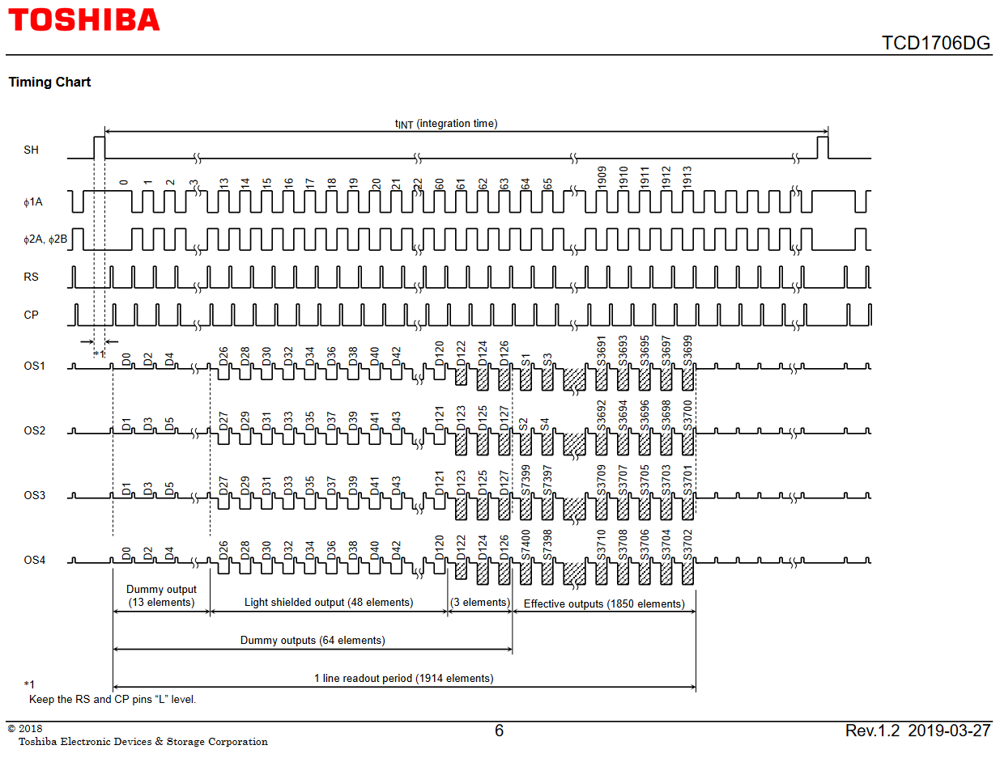
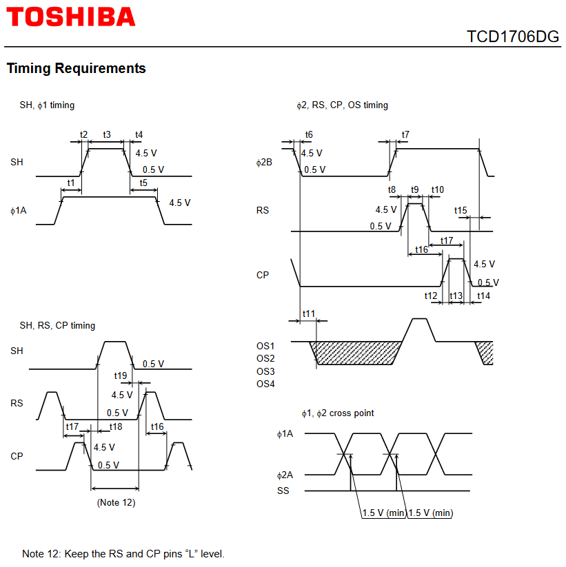
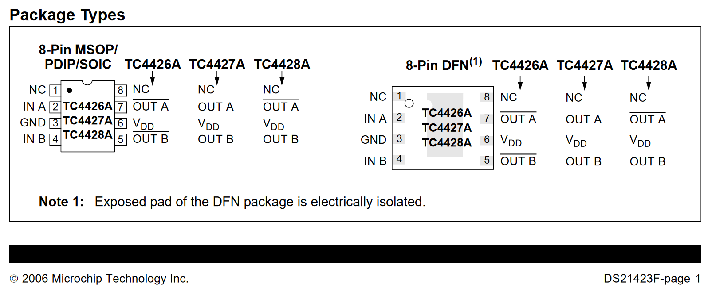

# Project notes

## What's this about?

I want to be able to use linear CCD imagers in my further projects.

Be it for scanned linear cameras, spectrometers, positioning systems or whatever I feel like.

This project's main goal is to figure out how'd I do that, with as raw a CCD chip as possible, to open up the widest
range of options for the future projects.

## If you are replicating this

### Do NOT

- Do _NOT_ use the [iCE5LP4K][datasheet-ice5lp4k] FPGA that I used. Even if you don't know what you're doing and want to
  just get something running with my exact files. DO. NOT.
    - At the time of writing, it and its series has _NO_ support by
      the [open source FPGA toolchains](https://github.com/YosysHQ/fpga-toolchain).
    - You'll be stuck with the _awful_ Lattice iCECube2 "IDE".
    - You _WILL_ regret this.
    - _USE LITERALLY ANYTHING ELSE_ that you're actually familiar with using.
    - I have no idea why I went with this particular FPGA.
    - Could be in part to do with Lattice's confusing naming scheme, which calls these FPGAs iCE40 Ultra™ Family.
      It seems _NOT_ to be part of the iCE40 family, no matter what marketing says.
    - If you aren't, start with some other FPGA that is supported by the
    - I'm only using this because I have a couple boards with these that fit into a breadboard,
      which it keeps the wiring tidier at the cost of pain elsewhere.

## Goals

The goals of this project are as follows:

- [ ] Get a linear CCD running, showing some image data on an oscilloscope
    - [ ] Create some prototype driver for this linear CCD
        - I wish to use a [TCD1706][datasheet-tcd1706] linear CCD.
            - Reasonably priced on AliExpress
            - Excellent resolution: 7400 elements (4.7µm × 4.7µm squares)
            - Other Toshiba CCDs seem to use very similar drive waveforms
        - I wish to be able to use my custom FPGA dev board; at least for the timing generation
            - I just so happen to have a couple on hand
            - Based on small Lattice [iCE5LP4K][datasheet-ice5lp4k] FPGAs
            - Should™ be good enough for timing generation for early experiments
        - I will likely need to use some driver ICs to drive the large capacitance pins
            - I have some [TC4426~TC4428][datasheet-tc442x] on hand.
                - Cheap and cheerful
                - Two channels per package
                - The specs seem to be reasonable
        - Actual goals:
            - [ ] Timing generation with FPGAs
            - [ ] Robust enough electrical design
                - [ ] Stay within timing margins for the CCD
                - [ ] Pretend EMI is not a concern, until it is
                - [ ] Ideally support all 5, 10, and 12V drive levels
                - [ ] Buffer CCD outputs
            - [ ] Figure out what sampling rates/timings should one use based on exposure levels
                - [ ] Configurable timing generation would be a big plus
- [ ] Capture image data at as fast a framerate as possible
    - [ ] Some FPGA-based capture system
        - [ ] Fast ADCs to sample the CCD waveforms
            - I have obtained several [AD80066][datasheet-ad80066] fast ADCs/CCD signal processors.
                - 16-bit, 24 MSPS, 4-channel beasts
                - CCD-ready front-end with weird correlated double sampler magic. No idea what that is, but it might
                  help!
        - [ ] Buffer to on-board memory
            - Probably use some bigger FPGA, like the [Artix7 FPGA board][datasheet-qmtech-artix] that I also have on
              hand
            - Or maybe the [CYUSB3KIT-003][datasheet-cyusb3kit]?
        - [ ] Send/stream to PC
            - I have obtained a [CYUSB3KIT-003][datasheet-cyusb3kit] for USB3 streaming experiments
            - Has some funky state machines on-chip
            - Can use external memory for buffering more stuff
            - Maybe I don't even need an FPGA!

## CCD notes

Some notes about CCDs I've either found out or read about so far:

- CCDs are supposedly _very_ static-sensitive. I see _nothing_ on the output of mine so far, meaning I, or someone where
  I've ordered the parts from, might have screwed up.
- CCD timing/waveform specs are non-negotiable. It just _will not work_ unless you do what the spec says.
- CCD timing/waveform specs are still somewhat imprecise. The datasheet doesn't tell you what to do and what to watch
  out for in actual words. _Always_ check your assumptions.
- Odds are you may _need to_ keep the CCD clocks running all the time, else bad things happen.
- CCDs may easily over-expose. It may be a good idea to put alu foil over the whole sensitive area and all around, to
  prevent light leaks, until the actual timings are figured out and debugged enough.

## Timing waveform notes

- The clocks run _the entire time_, unless the whole SH-high stuff happens
- Configurable values:
    - tINT
    - clock period length
    - RS pulse length (~t9)
    - CP pulse length (~t13)
    - distance between starts of RS/CP (~t16)
    - SH pulse width (t3)
    - distance between stop of RS/CP/ø and start of SH (t1)
    - distance between starts of SH and the whole RS/CP/ø release (t5)
- Intrinsic values:
    - Rise/fall times (t2, t4, t6, t7, t8, t10, t12, t14)
        - Depend mostly on drivers/pin capacitance
            - May be tweaked with RC networks or other analog sorcery
- Important things to watch out for other than timings:
    - ø1 vs ø2 cross point
        - Not heeding this recommendation _will_ result in spilled electrons (or something) and loss of captured image.

### Implementation notes

- The widths of RS (t9), CP (t13) and clock shall be derived directly from a master clock
    - Likely 48MHz (20.83ns) clock, based off the [iCE5LP4K][datasheet-ice5lp4k]'s internal clock
- tINT may be given in clock periods to keep the counters short
- How does one actually implement it then?
    - State machines!
        - Trigger "clock" state machine building the RS/CP/clock pulses every cycle
        - Trigger the "capture" state machine building the SH pulse and requisite "clock muting" periods
        - Probably the more sane thing to do
        - \+ Likely a better use of FPGA resources (fewer, reusable counters)
        - \- Not quite as obvious, modification more difficult
    - "Timing blocks"
        - Building blocks with triggerable functions, such as:
            - Delay by N cycles
            - Pulse of N cycles
            - Repeat after N cycles
        - \+ Cute, easy to visualize/conceptualize and modify
        - \- Likely not the best use of FPGA resources
        - \+ Easily testable small units
        - \+ May be used as a reference implementation to test the state machine-based implementation against!
        - \~ Try this first, see if it fits. If it doesn't, use SMs.
- RS/CP pulse widths are on the same order of time as the reference clock.
    - RS/CP pulse width: 10\~200ns typ.; 20ns reference clock -> 0.5\~10 clock cycles.

- List of signals to be driven:
    - SH (50 pF × 1 ⇒ 50 pF)
    - ø1 (300 pF (A) × 2 ⇒ 600 pF)
    - ø2 (300 pF (A) × 2 + 20 pF × 2 (B) ⇒ 640 pF)
    - RS (20 pF × 2 ⇒ 40 pF)
    - CP (20 pF × 2 ⇒ 40 pF)
- Driver layout:
    - IC 1: TC4428A
        - Comp A: ø1
        - True B: ø2 (not ø1)
    - IC 2: TC4427A
        - Comp A: SH
        - Comp B: — (not connected)
    - IC 3: TC4427A
        - Comp A: RS
        - Comp B: CP

### Driver notes

- I have 3 variants of the driver IC on hand:
    - TC4426
        - Both channels **are inverted**
    - TC4427
        - Both channels **are true** (non-inverted)
        - Annoyingly, I've only got these in SOIC, not DIP.
    - TC4428
        - Channel A **is inverted**, channel B **is true**

### Build schedule

- [ ] Verify that I can actually get the CCD running
    - [ ] See that the FPGA and the FPGA programmers work.
        - See [WiProg](https://github.com/kutis96/wiprog)
    - [ ] Work on the timings code. Testbench it before deploying, dummy.
    - [ ] Deploy, using capacitors as simulated loads for the drivers. CDon't touch the CCD yet, dummy.
        - [ ] Make sure that no constraints are violated, use an oscilloscope.
    - [ ] If all looks okay, hook up the CCD.
        - [ ] Make sure that no constraints are violated, use an oscilloscope.
    - [ ] If there's some output from the CCD, you're all good. This part of the project is done.

[datasheet-tcd1706]: https://toshiba.semicon-storage.com/info/docget.jsp?did=60748&prodName=TCD1706DG

[datasheet-ice5lp4k]: https://eu.mouser.com/datasheet/2/225/lattice_ice40ultra-1174814.pdf

[datasheet-tc442x]: https://www.tme.eu/Document/1c686891e827f551e3ee5b44a35f43a9/tc4427a.pdf

[datasheet-cyusb3kit]: https://www.infineon.com/cms/en/product/evaluation-boards/cyusb3kit-003/

[datasheet-ad80066]: https://www.analog.com/media/en/technical-documentation/data-sheets/AD80066.pdf

[datasheet-qmtech-artix]: https://github.com/kutis96/QM_XC7A35T_SDRAM